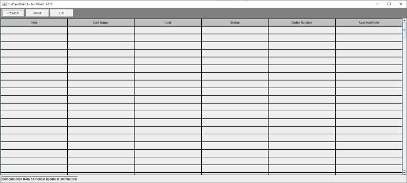

## myView

Back in the day (2010 ish) I almost got into trouble for this one !

At that time we had to order equipment/parts on a SAP system , we would then have to wait until the internal account holder had approved the order before manually placing the order by telephone. Problem was finding out if an order had been approved or not required someone to log onto the system via a webpage then make about 10 clicks to find the status of every order you wanted to make. All very time consuming , especially if 5pm was approaching and you wanted to place an order before heading home so you would have the parts for the following day.

So being an engineering type I decided to write my own solution. I used Java as ..

* This was my language of choice back then (these days it is usually C++) but I still have a soft spot for Java.

* Java allowed me to use the rather excellent [HtmlUnit](https://htmlunit.sourceforge.io/) library.

In short the program uses HtmlUnit as what is called a 'GUI-less' browser. It connected to the SAP system which just saw a Firefox browser connecting but this was all invisible to the programs user. Instead HtmlUnit dumped the raw HTML and Javascript back on my program which then parsed it , found out what orders the user had placed then automatically followed the links needed to find out the orders status. All of this would be then displayed in a single Java AWT window ..

So the user could see the status of all their orders at a glance. This status page would be automatically updated every 10 minutes or so. This allowed people to get on with their work while having this running in the background and moment an order was approved to see the purchase number and to then place the order. It soon became very popular with the staff which turned out not to be a _good thing_ as before long it came to the attention of the Finance dept specifically the SAP people. They decided that this was **hacking** and the program sent to Germany for analysis. Nothing came of all of this but I was told not to waste my time on this sort of thing in the future. 

Thankfully the SAP system was updated so it placed orders and there was no need for it anymore. But its a nice little curio and since I wrote it in my own time I thought I would archive it here.

[Ian Wraith](https://twitter.com/IanWraith) 26th January 2021